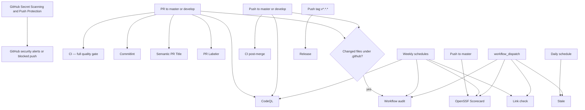
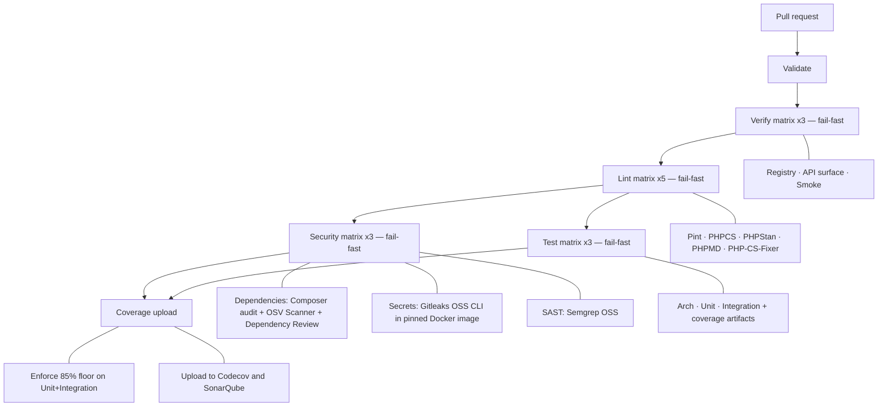
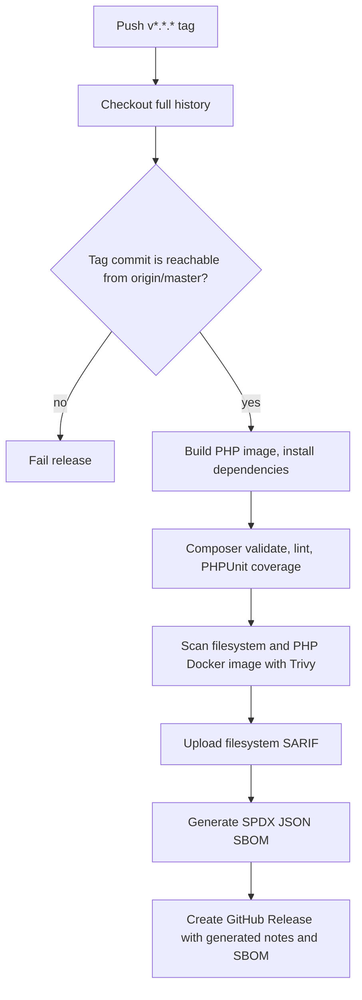

# GitHub Actions workflow flow

This document describes the workflows currently defined in
`.github/workflows/`. All jobs run on GitHub-hosted `ubuntu-latest` runners.
PHP-related commands run through the repository Docker Compose setup
(`tools/ci/docker-compose`), which executes containers as the runner user
(`DOCKER_UID`/`GID`) so no root-owned files are produced. The pull-request
gate and the post-merge pass are split into two workflows; branch protection
on `master`/`develop` requires the pull-request checks before merge.

## Overall event flow



## Pull-request gate (`ci.yml`)

**Trigger:** pull requests targeting `master` or `develop`.
Concurrent runs for the same pull request cancel older in-progress runs.



Every job checks out the source, builds the PHP image, restores or installs
Composer dependencies (cache keyed on `composer.lock`), then runs its tool.
The security matrix legs share the job definition and select their tool via
the matrix name; `fail-fast` cancels pending legs once one leg fails.

## Post-merge pass (`ci-post-merge.yml`)

**Trigger:** pushes to `master` or `develop` (i.e., right after a merge).

```text
Validate → Test matrix ×3 (fail-fast) → Coverage upload → Codecov + Sonar
```

A light sanity pass only: linting and security scanning already gated the
pull request, so the post-merge run verifies the freshly created merge
commit and refreshes the coverage baseline.

## Release flow (`release.yml`)

**Trigger:** push of a tag matching `v*.*.*`. Runs are not cancelled.



The workflow fails if the tag is not on `origin/master`. Do not tag until
the maintainer approves the release.

## Other workflows

| Workflow | Trigger | Flow / result |
| --- | --- | --- |
| `codeql.yml` | Push/PR on `master` or `develop`; Monday 06:00 UTC | Checkout → initialize CodeQL for GitHub Actions only → analyze and publish security results. |
| `commitlint.yml` | PR opened, edited, synchronized, reopened | Checkout full history → validate every PR commit against `.github/commitlint.config.mjs`. |
| `semantic-pr.yml` | PR opened, edited, synchronized | Validate PR title type and require an uppercase first subject character. Skipped for Dependabot pull requests. |
| `pr-labeler.yml` | PR opened, synchronized, reopened | Checkout → apply labels from `.github/labeler.yml` based on changed paths. |
| `link-check.yml` | Monday 04:00 UTC; manual | Checkout → Lychee checks Markdown links, excluding `vendor`, Packagist, Codecov, and mail links. |
| `scorecard.yml` | Push to `master`; Monday 00:00 UTC; manual | OpenSSF Scorecard → upload SARIF. |
| `stale.yml` | Daily 01:00 UTC; manual | Mark issues/PRs stale after 60 inactive days; close 14 days later, except pinned/security/dependencies. |
| `workflow-audit.yml` | `.github/**` changes on push/PR; Monday 03:00 UTC; manual | Independent jobs: Actionlint checks workflow syntax and Zizmor scans workflow security, then uploads Zizmor SARIF when produced. |

## Scheduled maintenance timeline

All cron expressions use UTC, not the runner's local timezone.

```mermaid
gantt
    title Scheduled workflows (UTC)
    dateFormat  HH:mm
    axisFormat  %H:%M
    section Monday
    OpenSSF Scorecard      :milestone, 00:00, 0m
    Stale (also daily)     :milestone, 01:00, 0m
    Workflow audit         :milestone, 03:00, 0m
    Link check             :milestone, 04:00, 0m
    CodeQL                 :milestone, 06:00, 0m
```



## Branch protection

Both `master` and `develop` require pull requests with these status checks:
`Validate`, the three `Verify (…)` legs, the five `Lint (…)` legs, the three
`Security (…)` legs, `Test (Arch)`, `Test (Unit)`, `Test (Integration)`,
`Coverage upload`, `Analyze GitHub Actions`, `Validate commit messages`, and
`Validate PR Title`. Strict mode requires the branch to be up to date.
Force pushes and deletions are denied. Admins cannot bypass protection.
`enforce_admins` is enabled on both long-lived branches.

## Notes

- All jobs use GitHub-hosted `ubuntu-latest`. There is no self-hosted runner pool.
- All declared workflows use dedicated repository configuration; none use
  `jooservices/workflows`.
- Secret scanning has two layers: GitHub Secret Scanning and Push Protection
  detect or block supported secrets at GitHub, while the pull-request gate
  scans the checked-out Git history with the MIT-licensed Gitleaks OSS CLI.
- The coverage job uploads the merged report to Codecov and SonarQube. It
  normalizes a scheme-less `SONAR_HOST_URL` to `https://…` before scanning.
  Sonar analysis waits for the quality gate for up to 300 seconds. A failed
  gate fails the required `Coverage upload` job. Bot PRs must pass the same
  Sonar gate; maintainers must provision the appropriate Dependabot secrets
  or reproduce the change on a reviewed maintainer branch when secrets are
  unavailable. Never execute untrusted PR code using `pull_request_target`.
- `Validate commit messages` checks every PR commit's author and committer
  against `Viet Vu <jooservices@gmail.com>`. Commitlint also validates merge
  subjects instead of ignoring them. Existing historical violations are not
  rewritten by this workflow.
- Containers run as the runner user through `tools/ci/docker-compose`
  (`DOCKER_UID`/`DOCKER_GID`), so workspace files are never root-owned.
